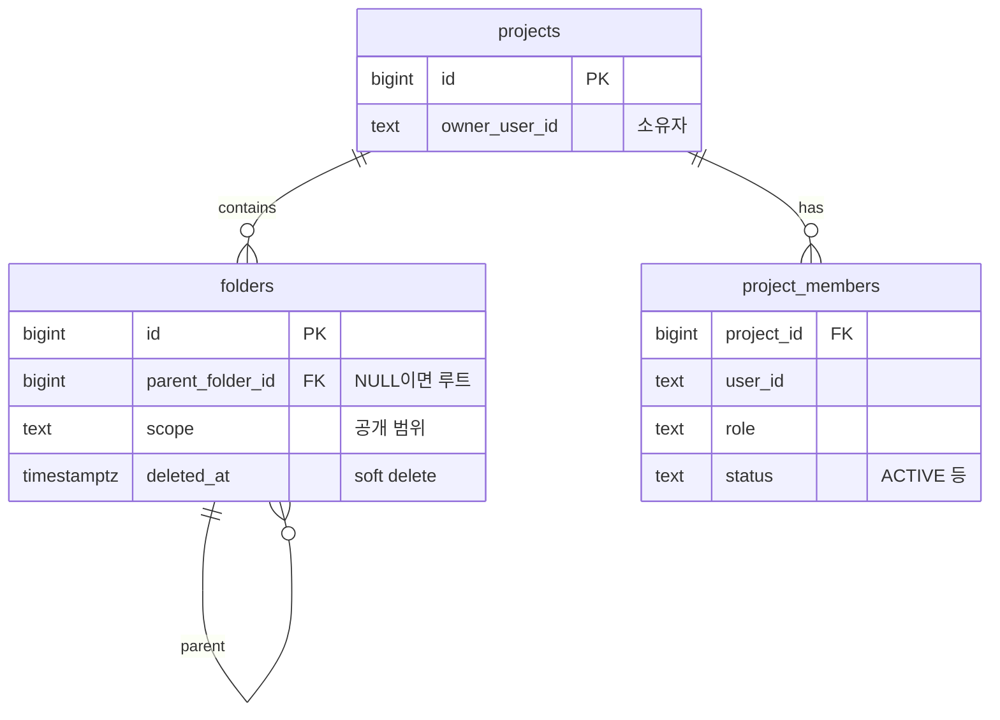

권한 판정은 뜨거운 경로다. 거의 모든 요청이 "이 사용자가 이걸 볼 수 있나"를 통과하고, 여기서의 실수는 성능 저하가 아니라 권한 유출로 나타난다. 폴더 트리 기반 RBAC의 성능을 손보면서 세 번의 결정을 내렸는데, 셋 다 같은 질문의 다른 각도였다 — **재사용, 정확성, 성능을 어디서 끊는가.**

전제가 되는 데이터 모델은 단순하다:

폴더는 트리를 이루고, 폴더의 유효 공개 범위는 조상 폴더들의 scope 중 가장 좁은 것으로 정해진다. 사용자는 프로젝트의 소유자이거나 멤버다.

## 결정 1. 멤버십 확인에 권한 판정 함수를 재사용하지 않는다

"여러 사용자가 이 프로젝트의 멤버인가"를 확인하는 함수가 있었다. 기존 구현은 사용자마다 권한 판정 함수 — "이 사용자가 이 프로젝트에서 무엇을 할 수 있나"를 소유자 여부·역할·권한까지 전부 계산하는 무거운 함수 — 를 호출했다. **권한 로직은 단일 진실원천에서 재사용한다**는 원칙을 지킨 코드다.

그런데 여기서 필요한 답은 "멤버인가" 하나뿐이다. 매 사용자마다 권한 전체를 계산하니 의미도 안 맞고, 쿼리가 사용자 수만큼 늘었다(N+1). 그래서 소유자 조회 1회 + 입력 사용자들의 ACTIVE 멤버 여부 배치 조회 1회, **사용자 수와 무관하게 2쿼리**로 바꿨다. "소유자이거나 ACTIVE 멤버면 통과" — 기존 판정과 결과는 같고 불필요한 계산만 없다.

대신 함정이 하나 붙는다. 소유자 비교를 느슨하게 하면, 빈 문자열 같은 비정상 userId가 "소유자 없음(null)"과 **우연히 일치해 통과**할 수 있다. 보안 인접 코드에서 null 비교는 곧잘 fail-open이 된다. 그래서 입력 userId가 소유자와 같은지를 직접 비교하도록 명시했다.

트레이드오프: "멤버 = 소유자 OR ACTIVE 멤버"라는 규칙을 이 함수가 직접 들게 됐다. 단일 진실원천 원칙의 부분 포기다. 규칙이 한 줄이라 수용했고, 대신 권한 판정 함수는 "권한이 실제로 필요한 곳"에만 쓰는 것으로 책임이 갈렸다.

## 결정 2. 조상 순회를 재귀 CTE로 — 단, 기존 동작 100% 보존이 조건

폴더의 유효 scope를 계산하는 함수는 맨 아래 폴더에서 루트까지 한 칸씩 올라가며 **한 칸마다 DB에 따로 물어봤다**. 깊이 D면 D번의 순차 왕복이다. 권한 판정 길목에서 불리는 함수라 이 왕복이 매 접근 판정에 끼어든다.

짚어둘 것: 이건 결과가 틀리는 버그가 아니다. 각 조회는 PK 인덱스를 타는 가벼운 조회고 폴더 트리는 보통 얕다. 그래서 이 결정의 기준을 "얼마나 빨라지나"가 아니라 **기존 동작을 그대로 보존하나**로 잡았다. 실측 없이 성능을 주장하지 않는다 — 구조적으로 왕복이 깊이 D회에서 1회로 준다는 사실만 말할 수 있다.

`parent_folder_id`를 따라 올라가는 순회를 `WITH RECURSIVE` 한 방으로 바꾸고, 받아온 조상들 중 가장 좁은 scope를 고르는 로직은 순수 함수로 떼어냈다. 이때 루프 순회와 결과가 미묘하게 달라질 수 있는 **함정이 3가지** 있었고, 셋 다 재현하는 게 작업의 본체였다:

1. **삭제된 조상에서 멈춤** — `deleted_at IS NULL` 조건을 시작 폴더와 재귀 양쪽에 넣어야 한다. 한쪽에만 넣으면 "중간에 삭제된 조상이 있으면 거기서 순회를 멈춘다"는 기존 의미가 깨진다.
2. **순환 방지** — 지나온 폴더 id를 경로 배열로 들고 다니며 재방문을 차단한다. 루프 시절의 방문 기록 Set과 같은 역할.
3. **타이브레이크** — leaf→root 순서를 지키고, 제한 수준이 같으면(`>=`) leaf에 가까운 폴더를 scope의 출처로 삼는다. 기존 규칙 그대로.

검증도 둘로 갈랐다. 순수 함수는 단위 테스트로. mock으로는 검증이 안 되는 재귀 SQL 자체는 **로컬 PostgreSQL에서 ROLLBACK 트랜잭션 안에 임시 폴더 트리를 만들어** 세 함정을 실제로 돌렸다. 마지막으로 17개의 서로 다른 트리에 대해 기존 방식과 새 방식을 대조해 한 건도 어긋나지 않음을 확인했다.

부작용 하나는 기록해뒀다: 이 재귀 SQL은 단위 테스트가 없다(있을 수 없다). 나중에 이 부분을 고치는 사람은 실제 DB 수준의 검증을 다시 해야 한다.

## 결정 3. 넣었던 방어 코드를 되돌리다

권한 조회 결과를 요청 동안 캐시하는 컨텍스트 객체가 있었다. 목록 화면처럼 한 프로젝트 안에서 권한 확인이 반복되는 곳의 N+1을 줄이는 물건이다. 이걸 문서 접근 검문소에도 적용하려던 중 우려가 나왔다 — **한 문서가 여러 프로젝트에 걸치면, 캐시가 첫 프로젝트의 소유자·역할을 다음 프로젝트에 잘못 재사용해 권한이 샌다**(크로스-프로젝트 fail-open). 막으려면 캐시를 프로젝트별로 키잉해야 했고, 실제로 그렇게 고쳤다.

그리고 데이터 모델을 확인했다. **한 문서는 한 프로젝트에만 귀속된다.** 문서를 프로젝트에 추가하는 코드가 그 문서 파일들의 project_id를 해당 프로젝트로 덮어쓰고(파일의 project_id 컬럼은 하나뿐이다), 문서를 다른 프로젝트로 공유하는 기능 자체가 없으며, 실제 데이터도 전부 1:1이었다. 검문소의 프로젝트 루프는 사실상 0~1회 — 우려한 fail-open은 **도달 불가능한 시나리오**였다.

그래서 재키잉을 되돌렸다. 최종 결정: 캐시는 단일 프로젝트 작업(목록 조회, 후보 검증)에만 쓰고 접근 검문소엔 적용하지 않는다. 이유가 둘인데 둘 다 단순함이다 — 루프가 0~1회라 캐시 이득이 없고, 사용 범위를 한 프로젝트로 한정하면 안전성이 자명해져 보안 경로에 조건부 추론이 사라진다.

단서 하나: 스키마가 "문서=단일 프로젝트"를 강제하진 않는다. 나중에 문서를 여러 프로젝트에 공유하는 기능이 생기면 이 전제가 깨지므로, 그 기능이 캐시의 프로젝트 안전성을 직접 책임져야 한다고 결정문에 못 박아뒀다.

## 세 결정이 남긴 규칙

1. **캐시·쿼리를 합치기 전에 루프 횟수부터 세라.** 결정 1의 N+1은 합칠 가치가 있었고(N=사용자 수), 결정 3의 루프는 0~1회라 캐시 자체가 무의미했다. 최적화 대상인지부터가 측정 문제다.
2. **보안 인접 코드에서 null 비교는 통과가 된다.** "소유자 없음"과 "비정상 입력"이 같은 값으로 표현되는 순간 fail-open이다. 명시적 동등 비교로 막는다.
3. **방어 복잡도는 시나리오가 도달 가능할 때만 산다.** 도달 불가능한 케이스를 위한 방어 코드는 보안 경로의 가독성을 갉아먹는 비용일 뿐이다. 단, "왜 안 해도 되는지"의 전제는 문서로 남겨서, 전제를 깨는 미래 변경이 재검토를 트리거하게 한다.
