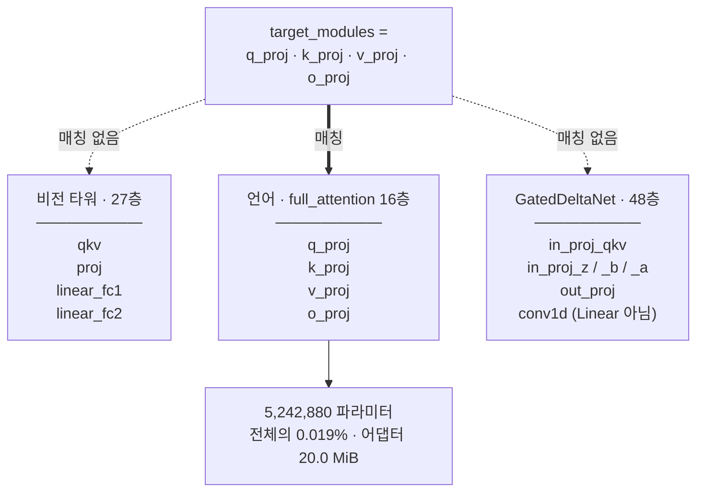

27B 비전 언어 모델을 AWS에서 QLoRA로 **한 번** 끝까지 돌렸다. 성능이 목적이 아니라 파이프라인이 실제로 도는지 보는 것이 목적이었다. 58분 뒤에 어댑터가 나왔고 $0.907이 나갔다.

아래는 그 한 바퀴에서 **추정이 실측에 정정된 14개 지점**과, 그 지점을 이해하는 데 필요한 개념들이다. 읽는 사람은 AWS와 코드는 알지만 ML은 처음이라고 가정했다.

| | |
|---|---|
| 가동 시간 | **58분 02초** — 종료 확인까지 |
| 실제 비용 | **$0.907** — 스팟 $0.9129/h + EBS |
| 처리량 | **274.2 tok/s** — 워밍업 제외 31스텝 |
| 피크 VRAM | **31.18 GiB** allocated (45 GiB 중) |
| 어댑터 | **20.0 MiB** — 학습 파라미터 5,242,880 |

> [!note] 이 글의 숫자에 대해
> 전부 그 런의 로그·메트릭·AWS API 응답에서 나온 값이다. 추정치는 "추정"이라고 적었다.
> 사내 식별자(버킷명·인스턴스 ID·내부 티켓 번호)는 일반화했다. 기술 내용과 측정값은 원본 그대로다.

---

# 0부 — 왜 순서가 먼저인가

이 사이클의 설계는 기술이 아니라 순서였다. 무엇을 GPU 없이 끝낼 수 있는지가 비용의 대부분을 결정한다.

## 0.1 요금이 흐르는 자원과 안 흐르는 자원

AWS 리소스는 두 종류다. **시간당 과금되는 것**(EC2 인스턴스, EBS 볼륨, NAT 게이트웨이)과 **존재 자체는 공짜인 것**(IAM 역할, 보안그룹, 키페어, S3 버킷 자체).

이번 런에서 만든 것 중 요금이 흐른 것은 인스턴스와 200 GB EBS 둘뿐이고, 나머지 넷은 지금도 계정에 남아 있지만 $0이다.

이 구분이 중요한 이유는 **준비 작업을 어디까지 앞당길 수 있는가**를 정하기 때문이다. 키페어·보안그룹·IAM 역할은 인스턴스를 켜기 전에 다 만들어 둘 수 있고, 그러면 인스턴스가 뜬 직후부터 바로 일을 시킬 수 있다.

## 0.2 켜기 전에 끝낸 것들

GPU를 켜기 전에 다음을 전부 끝냈다.

- 체크포인트가 실제로 받아지는지 확인
- 학습 데이터셋 32샘플 생성
- 학습·업로드·검증 스크립트 3종 작성
- 라이브러리 버전 호환 확인
- 스팟 가격과 AZ 조사
- IAM·SG·키페어 생성

이 작업들은 전부 로컬과 무료 API 호출로 끝난다.

```
무과금 — GPU 없음                    │  과금 — 스팟 $0.9129/h
체크포인트 검증 · 데이터셋 32샘플      │  다운로드 · 로드 · 학습 · S3 · 검증
스크립트 3종 · IAM · SG · 키페어       │  58분 02초 → $0.907
                                     ↑
                              run-instances
                        여기 오른쪽만 돈이 든다
```

비용은 작업량이 아니라 인스턴스가 켜져 있던 시간에 붙는다. 조사·설계·코딩을 경계 왼쪽으로 밀어낼수록 오른쪽이 짧아진다.

## 0.3 증명과 학습은 다른 작업이다

"배관 검증"(pipeline proof)은 **각 단계가 서로 연결되는지만** 보는 작업이다. 모델이 무엇을 배웠는지는 보지 않는다. 이 구분을 흐리면 데이터를 늘리고 에폭을 올리고 싶어지는데, 그러면 검증에 몇 시간과 몇십 달러가 든다.

대신 명시적인 완료 조건을 먼저 못 박았다.

1. 학습 스크립트가 끝까지 실행
2. LoRA 어댑터 파일 생성
3. S3 업로드
4. 다시 받아서 base에 붙여 추론 1회
5. 실제 비용 보고

다섯 개가 전부 참이면 끝이고, 그 외에는 아무것도 하지 않는다.

---

# 1부 — 모델을 고르기 전에 확인할 것들

인스턴스를 켜 두고 모델을 찾으면 요금만 흐른다. 여기 있는 것들은 전부 무료 HTTP 요청으로 끝난다.

## 1.1 체크포인트 가용성의 4요소

- **게이팅** — Hugging Face의 일부 모델은 접근 승인이 필요하다(`gated: true`). 승인에 며칠이 걸릴 수 있다.
- **라이선스** — 상업적 사용 가능 여부. 이번 모델은 Apache-2.0이었다.
- **포맷** — 학습 가능한 원본 가중치인가, 추론용 양자화본인가.
- **크기** — 디스크·다운로드 시간·EBS 크기가 여기서 정해진다. 55.6 GB였다.

이 넷은 API 한 번으로 다 나온다.

```bash
# 메타데이터 — 게이팅·라이선스·파일 목록
curl -s "https://huggingface.co/api/models/<org>/<model>"

# 토큰 없이 진짜 받아지는지 (206 이면 CDN 이 인증 없이 준다)
curl -sL -r 0-10485759 -o /dev/null -w "%{http_code}" \
  ".../resolve/main/model-00001-of-00018.safetensors"
# → http=206  size=10485760  speed=6.06 MB/s
```

## 1.2 추론용 양자화본은 학습에 못 쓴다

사내에서 서빙 중이던 것은 같은 모델의 **NVFP4 양자화본**이었다. 이건 추론용으로 미리 압축해 구운 것이라 학습에 쓸 수 없다. 이유를 알려면 양자화가 무엇을 버리는지 봐야 한다.

원본 가중치는 bf16(16비트 실수)이다. NVFP4·GGUF·AWQ 같은 추론용 포맷은 이걸 4비트 정수 격자에 맞춰 **되돌릴 수 없게** 눌러 담는다. 학습은 가중치에 아주 작은 변화를 누적하는 작업인데, 4비트 격자에서는 그 작은 변화가 표현되지 않고 그대로 사라진다.

QLoRA는 다르다. **bf16 원본을 받아서 메모리에 올릴 때 4-bit로 양자화**하고, 학습되는 변화량은 별도의 bf16 어댑터에 쌓는다. 시작점이 반드시 bf16 원본이어야 하는 이유가 이것이다.

## 1.3 `config.json` 하나로 알 수 있는 것

모델 리포의 `config.json`은 가장 정보 밀도가 높은 파일이다. 이번에 여기서 뽑아낸 것:

| 필드 | 값 | 이게 말해주는 것 |
|---|---|---|
| `architectures` | `..ForConditionalGeneration` | VLM이다 (텍스트 전용이면 `ForCausalLM`) |
| `model_type` | `qwen3_5` | transformers 안에서 찾을 디렉터리 이름 |
| `dtype` | `bfloat16` | 학습 가능한 원본이다 |
| `transformers_version` | `5.8.0.dev0` | 최소 요구 버전 (1.4 참고) |
| `layer_types` | `[linear ×3, full] × 16` | 하이브리드 구조 (2.1) |
| `vocab_size` | `248320` | 임베딩 크기 계산에 쓴다 (3.3) |
| `vision_config.patch_size` | `16` | 비전 토큰 수 계산 (2.4) |

## 1.4 `5.8.0.dev0`을 요구하는 config를 만났을 때

`transformers_version: "5.8.0.dev0"`은 "이 모델은 transformers 5.8 개발 브랜치에서 만들어졌다"는 뜻이다. dev 버전을 요구하는 것처럼 보이지만, 실제로 물어야 할 질문은 다르다 — **릴리스된 버전 중에 이 아키텍처가 들어간 게 있는가?**

답을 확인하는 가장 확실한 방법은 해당 태그의 소스 트리를 직접 두드려 보는 것이다.

```bash
curl -o /dev/null -w "%{http_code}" \
  https://raw.githubusercontent.com/huggingface/transformers/v5.16.1/src/transformers/models/qwen3_5/modeling_qwen3_5.py
# → 200   릴리스본에 이미 있다. dev 브랜치도 trust_remote_code 도 필요 없다.
```

이게 통하지 않았다면 선택지는 셋이었다. dev 브랜치를 설치하거나, `trust_remote_code`로 리포의 모델 코드를 실행하거나, 다른 모델로 가거나. 셋 다 위험과 비용이 다르므로 **GPU를 켜기 전에** 알아야 했다.

## 1.5 `trust_remote_code`가 실제로 하는 일

이 플래그를 켜면 transformers는 **모델 리포에 들어 있는 파이썬 파일을 내려받아 실행**한다. 아키텍처가 아직 라이브러리에 병합되지 않았을 때 쓰는 장치인데, 사실상 임의 코드 실행이다. 리포 소유자가 바뀌거나 커밋이 하나 추가되면 다음 `from_pretrained`가 다른 코드를 실행한다.

꼭 써야 한다면 `revision="<커밋 해시>"`로 고정하라. 브랜치 이름은 움직인다. 이번에는 릴리스본에 있어서 안 썼다.

## 1.6 커널 의존성과 폴백

최신 아키텍처는 성능을 위해 커스텀 CUDA 커널을 쓴다. 이번 모델은 `causal_conv1d`와 `fla`(flash-linear-attention)를 쓰는데, 둘 다 별도 설치가 필요한 패키지다.

소스에서 확인한 것은 이 데코레이터였다.

```python
@use_kernel_func_from_hub_with_fallback("chunk_gated_delta_rule", "fla")
def torch_chunk_gated_delta_rule(...):
```

`with_fallback`이 붙어 있으면 **커널이 없을 때 순수 PyTorch 구현으로 떨어진다.** 느려지지만 돈다. 배관 검증에서는 이걸로 충분하고, 실제로 커널 패키지를 하나도 설치하지 않았다. 처리량이 목표인 다음 사이클에서는 이 커널들을 넣고 274.2 tok/s가 얼마나 올라가는지 재야 한다.

## 1.7 파일 크기로 파라미터 수 역산하기

모델 카드에 파라미터 수가 안 적혀 있어도 계산할 수 있다. bf16은 파라미터 하나당 정확히 2바이트다.

```
safetensors 18개 합계 = 55.59 GB
55.59e9 / 2 = 27.8e9 파라미터 (27.8B)
```

이 숫자가 필요한 이유는 메모리 예산 때문이다. 4-bit로 올리면 대략 절반의 절반이 되니 **27.8B × 0.5바이트 ≈ 14 GB**라는 첫 추정이 여기서 나온다. 4부에서 이 추정이 왜 안 맞는지 본다.

---

# 2부 — 이 모델이 평범하지 않은 이유

"27B 트랜스포머"라고 부르면 놓치는 것들이 있다. 그 놓친 것들이 메모리와 LoRA 타겟 결정을 바꿨다.

## 2.1 하이브리드 어텐션 — 64층이 다 같지 않다

표준 트랜스포머는 64층이면 64층 전부 같은 어텐션을 쓴다. 이 모델은 아니다. `layer_types`를 보면 `linear_attention` 3개마다 `full_attention` 1개가 끼는 패턴이 16번 반복된다.

```
0    1    2    3     4    5    6    7      …    60   61   62   63
L    L    L    [F]   L    L    L    [F]    …    L    L    L    [F]
└─────────────────┘  └─────────────────┘         └─────────────────┘
      반복 1               반복 2                      반복 16

L = linear_attention (GatedDeltaNet) · 48개
F = full_attention   (표준 어텐션)   · 16개  ← LoRA 는 여기에만 붙는다
```

4층마다 하나씩만 표준 어텐션이다. 이 구조를 모르고 "모든 어텐션 층에 LoRA"라고 생각하면 실제로 어디에 붙는지 오해하게 된다.

## 2.2 GatedDeltaNet이 트랜스포머 블록과 다른 점

표준 어텐션은 **모든 토큰이 모든 토큰을 본다.** 길이 `n`이면 계산량이 `n²`로 늘어난다. 선형 어텐션(GatedDeltaNet은 그 한 종류다)은 대신 **고정 크기 상태를 하나 들고 다니며 갱신**한다. RNN에 가깝다. 계산량이 `n`에 비례하므로 긴 문맥에서 훨씬 싸다.

배관 관점에서 중요한 차이는 **여기 들어 있는 파라미터가 전부 `nn.Linear`가 아니라는 것**이다. 소스에서 확인한 구성은 이랬다.

```python
self.conv1d      = nn.Conv1d(...)     # Linear 아님 → 양자화 안 됨
self.dt_bias     = nn.Parameter(...)  # Linear 아님 → 양자화 안 됨
self.in_proj_qkv = nn.Linear(...)     # Linear → 4-bit
self.in_proj_z   = nn.Linear(...)
self.in_proj_b   = nn.Linear(...)
self.in_proj_a   = nn.Linear(...)
self.out_proj    = nn.Linear(...)
```

이 사실이 3.3과 4.1로 이어진다.

## 2.3 VLM의 두 몸통

비전 언어 모델은 사실상 두 개의 신경망이 붙어 있는 것이다.

- **비전 타워** (`model.visual`) — 이미지를 받아 벡터 열로 바꾼다. 여기서는 27층, hidden 1152.
- **언어 모델** (`model.language_model`) — 그 벡터를 텍스트 토큰과 같은 줄에 섞어서 처리한다. 64층, hidden 5120.

둘을 잇는 것이 `out_hidden_size: 5120`이다. 비전 타워의 출력 차원을 언어 모델의 입력 차원에 맞춰 놓은 것. 실무적으로 중요한 건 **이미지가 결국 "토큰"이 되어 언어 모델의 시퀀스 길이를 잡아먹는다**는 점이다.

## 2.4 ★ 비전 토큰 계산법 — 이미지가 예산을 먹는다

"2048 토큰 시퀀스"라고 하면 텍스트 2048개를 떠올리기 쉽다. VLM에서는 아니다. 이미지는 `patch_size × spatial_merge_size` 픽셀마다 토큰 하나가 된다. 이 모델은 `16 × 2 = 32`, 즉 **32×32 픽셀 블록 하나당 토큰 하나**다.

> [!warning] 추정 → 실측
> **추정** 페이지 이미지 한 장 + XML + 프롬프트면 2048 토큰에 넉넉히 들어간다
> **실측** 원본 페이지 **992 × 1403** → (992÷32) × (1403÷32) = **1,333 비전 토큰**. 예산의 **65%**를 이미지 하나가 먹는다

그래서 이미지를 픽셀 예산으로 줄였다. 토큰 수 = 픽셀 수 ÷ 1024이므로, `max_pixels = 262144`이면 상한이 256 토큰이다. 실측 평균은 246이었다.

```
토큰 = (W ÷ 32) × (H ÷ 32) = W × H ÷ 1024

원본  992 × 1403 = 1,391,776 px → 1,333 토큰
축소  512 × 512  =   262,144 px →   256 토큰 상한 (실측 평균 246)
```

## 2.5 이런 필드를 만나면 의심할 것

- `mtp_num_hidden_layers: 1` — 멀티토큰 예측 헤드. 추론 속도용 보조 헤드인데, 학습 시 loss 계산에 끼어들 수 있다. 이번엔 문제없었지만 loss 값이 이상하면 여기를 본다.
- `mamba_ssm_dtype: float32` — 일부 연산을 fp32로 강제한다는 뜻. 순수 bf16 학습을 가정한 메모리 계산이 어긋나는 원인이 된다.
- `tie_word_embeddings: false` — 임베딩과 `lm_head`가 **따로** 존재한다. 둘 다 세야 한다 (3.3).
- `max_position_embeddings: 262144` — 26만 토큰까지 가능하다는 뜻이지, 그렇게 넣으라는 뜻이 아니다. 메모리는 별개 문제다.

---

# 3부 — QLoRA 개념

Q + LoRA는 서로 다른 두 기법이 합쳐진 이름이다. 따로 이해해야 어디서 문제가 나는지 보인다.

## 3.1 LoRA — 왜 저랭크 어댑터인가

27.8B 파라미터를 전부 학습하려면 가중치 말고도 그래디언트와 옵티마이저 상태를 다 들고 있어야 한다. AdamW 기준으로 **파라미터 하나당 대략 16바이트**가 필요하니 27.8B × 16 ≈ 445 GB다. L40S 한 장으로는 불가능하다.

LoRA의 발상은 이렇다. 원래 가중치 `W`는 **얼려 두고**, 옆에 아주 얇은 행렬 두 개 `A`(입력→r)와 `B`(r→출력)를 붙여 `W + BA`로 쓴다. `r`이 **랭크**이고, 이번엔 8을 썼다.

```
원래 층:  5120 × 5120 = 26,214,400 파라미터
LoRA r=8: (5120×8) + (8×5120) = 81,920 파라미터   # 0.31%
```

- `r` (랭크) — 어댑터의 표현력. 크면 더 배우지만 메모리와 파일이 커진다.
- `lora_alpha` — 어댑터 출력에 곱하는 배율. 실효 배율은 `alpha / r`이다. 여기선 16/8 = 2. `r`을 바꿀 때 `alpha`도 같이 올리면 학습률을 다시 안 잡아도 된다는 게 관례의 이유다.

## 3.2 4-bit 양자화의 3층 구조

QLoRA의 Q는 `BitsAndBytesConfig` 네 줄에 다 들어 있다. 각 줄이 다른 일을 한다.

```python
BitsAndBytesConfig(
  load_in_4bit=True,
  bnb_4bit_quant_type="nf4",          # ① 격자 모양
  bnb_4bit_use_double_quant=True,     # ② 격자 눈금표까지 압축
  bnb_4bit_compute_dtype=bfloat16,    # ③ 계산은 bf16 으로
)
```

- **① NF4** — 신경망 가중치는 0 근처에 몰려 있는 정규분포에 가깝다. NF4는 16개 격자점을 균등하게 두지 않고 **정규분포 분위수에 맞춰** 배치한다. 같은 4비트로 더 정확하다.
- **② double quantization** — 가중치를 블록으로 나눠 블록마다 스케일 상수를 하나씩 둔다. 그 상수들도 양이 많아서 다시 양자화한다. 파라미터당 약 0.4비트를 아낀다.
- **③ compute dtype** — 저장은 4비트지만 **곱셈은 bf16으로** 한다. 연산 직전에 되돌려 푼다(dequantize). 그래서 4-bit 모델도 계산 정밀도는 bf16이다.

## 3.3 ★ 4-bit로 바뀌는 것은 `nn.Linear`뿐이다

"27B 모델을 4-bit로 올린다"는 말은 **모든 파라미터가 4비트가 된다**는 뜻으로 들린다. 아니다. bitsandbytes가 교체하는 것은 `nn.Linear` 모듈뿐이다. 나머지는 원래 dtype인 bf16으로 남는다.

> [!warning] 추정 → 실측
> **추정** 27.8B × 0.5바이트 = 약 14 GB면 가중치가 다 올라간다
> **실측** 로드 직후 **16.73 GiB**. 임베딩·`lm_head`·정규화층·`Conv1d`·비전 타워가 bf16으로 남기 때문

남는 것들 중 가장 큰 덩어리는 임베딩과 `lm_head`다. config 숫자로 정확히 계산된다.

```
임베딩   248,320 × 5,120 = 1,271,398,400 파라미터
lm_head  (tie_word_embeddings=false 라 따로 존재) = 동일
합계     2,542,796,800 × 2바이트 = 4.74 GiB    ← 이것만으로 이미 4.7 GiB
```

## 3.4 `llm_int8_skip_modules` — 일부러 4-bit를 피하는 것

이번 설정에서는 비전 타워와 `lm_head`를 양자화 대상에서 명시적으로 뺐다.

```python
llm_int8_skip_modules=["visual", "lm_head"]
```

- **비전 타워** — 언어 모델에 비하면 작다(27층 × hidden 1152). 아껴봐야 몇백 MB인데, 양자화가 이미지 인코딩 품질을 깨는 사례가 알려져 있다. 배관 검증에서 이 위험까지 떠안을 이유가 없다.
- **`lm_head`** — 어휘 248,320개로 사영하는 마지막 층. 여기 오차가 나면 곧바로 출력 토큰이 바뀐다. 대부분의 QLoRA 레시피가 기본으로 제외한다.

> [!info] 이름이 왜 int8 인가
> `llm_int8_skip_modules`는 8비트 시절에 생긴 이름인데 4비트에도 그대로 쓰인다. 라이브러리 역사가 남긴 흔적이라 헷갈리기 쉽다.

## 3.5 ★ `target_modules`는 **이름**으로 매칭된다

PEFT에 "어텐션 층에 LoRA를 붙여라"라고 말할 방법은 없다. 실제로 넘기는 것은 **모듈 이름 문자열의 목록**이고, PEFT는 모델 전체를 순회하며 **이름이 `.{target}`으로 끝나는 모든 `nn.Linear`** 를 교체한다. 구조가 아니라 이름이 기준이다.

이 모델은 세 종류의 선형층 뭉치를 갖고 있고, 각각 이름 규칙이 다르다.



PEFT는 모듈 이름이 `.o_proj`로 끝나는지를 본다. GatedDeltaNet의 `out_proj`는 `.out_proj`라서 걸리지 않는다 — **한 글자 차이로 48개 층이 비껴갔다.**

> [!danger] 이건 운이었다
> 모델마다 이름 규칙이 다르다. 다른 VLM에서 비전 타워가 `q_proj`를 쓴다면 **같은 설정이 조용히 비전 타워까지 학습시킨다.**
> 대응: `print([n for n, _ in model.named_modules()])`로 실제 이름을 먼저 찍어 보고, 붙인 뒤 `print_trainable_parameters()`로 개수를 확인한다.

## 3.6 학습 직전에 부르는 세 함수

```python
model = prepare_model_for_kbit_training(model, use_gradient_checkpointing=True)
model.gradient_checkpointing_enable(gradient_checkpointing_kwargs={"use_reentrant": False})
model.enable_input_require_grads()
```

- `prepare_model_for_kbit_training` — 양자화된 파라미터를 `requires_grad=False`로 고정하고, 정규화층을 fp32로 올리고(수치 안정), 출력 임베딩에 그래디언트가 흐르게 만든다. 안 부르면 학습이 조용히 안 된다.
- `gradient_checkpointing_enable` — 순전파 중간값을 저장하지 않고 **역전파 때 다시 계산**한다. 메모리를 크게 아끼는 대신 계산이 약 30% 늘어난다. `use_reentrant: False`는 새 구현을 쓰라는 뜻으로, 구현이 LoRA와 더 잘 맞는다.
- `enable_input_require_grads` — 그래디언트 체크포인팅은 입력에 `requires_grad`가 있어야 동작하는데, 얼린 임베딩의 출력에는 그게 없다. 이걸 안 부르면 `loss.backward()`가 에러를 낸다. **가장 흔한 QLoRA 함정이다.**

## 3.7 0.019%를 학습해서 20 MiB를 얻는다

| 항목 | 값 |
|---|---|
| 학습 파라미터 | **5,242,880** |
| 전체 파라미터 | 27,800,000,000 (근사) |
| 비율 | **0.019%** |
| 어댑터 파일 | 20,990,496 B = 20.0 MiB |
| base 체크포인트 | 55.6 GB |

운영 관점에서 이게 핵심이다. **base는 한 번 배치해 두고 어댑터만 갈아 끼우면 된다.** 태스크별로 20 MiB씩만 저장하면 되고, S3 업로드는 몇 초다. 실제로 이번 업로드는 20 MiB를 83.7 MiB/s로 올렸다.

---

# 4부 — 메모리, 가장 많이 틀리는 영역

이번 런에서 정정된 14개 중 3개가 여기 있다. 손계산이 실측과 어긋나는 방식이 일정하다.

## 4.1 ★ 손계산이 안 맞는 이유

가장 흔한 계산은 `파라미터 수 × 0.5바이트`다. 이번 경우 27.8B × 0.5 = 13.9 GB ≈ 12.9 GiB. 실측은 16.73 GiB였다. 3.8 GiB 차이가 어디서 오는지 분해하면 다음 사이클의 계산이 정확해진다.

| 덩어리 | dtype | 크기 | 근거 |
|---|---|---|---|
| 임베딩 + lm_head | bf16 | **4.74 GiB** | config로 정확히 계산 |
| 비전 타워 | bf16 | 약 0.8 GiB | 27층 × hidden 1152 추정 |
| Conv1d · 정규화 · `dt_bias` | bf16 / fp32 | 작음 | `nn.Linear` 아님 |
| 나머지 선형층 | NF4 + 스케일 | 잔여 | 4비트 + 양자화 상수 |
| **실측 합계** | — | **16.73 GiB** | `max_memory_allocated` |

> [!tip] 쓸 만한 어림
> 4-bit 가중치 실제 크기 ≈ (파라미터 수 − 임베딩 − lm_head − 비전) × **0.55바이트** + (임베딩 + lm_head + 비전) × 2바이트.
> 0.5가 아니라 0.55인 것은 블록별 양자화 상수 몫이다.

## 4.2 가중치는 시작일 뿐이다

학습 중 GPU 메모리는 네 덩어리로 나뉜다.

- **가중치** 16.73 GiB — 얼려 둔 base. 학습 내내 변하지 않는다.
- **LoRA 파라미터 + 그래디언트 + 옵티마이저** — 5.24M × (2+2+8)바이트 ≈ 60 MiB. 거의 무시할 수준이다.
- **활성값** — 순전파 중간 결과. 시퀀스 길이와 배치에 비례해 커진다.
- **일시 버퍼** — 4비트를 bf16으로 풀 때 생기는 임시 텐서 등.

실측 피크에서 가중치를 빼면 **31.18 − 16.73 = 14.45 GiB**가 활성값과 버퍼다. LoRA 관련은 60 MiB뿐이니 **사실상 전부 활성값**이다. 배치 1, 최대 1,948 토큰에서 그렇다.

## 4.3 ★ allocated와 reserved는 다른 숫자다

학습 중 `nvidia-smi`를 찍으니 32.5 → 37.6 → 43.0 GiB로 계속 올라갔다. 45 GiB짜리 카드였으니 OOM 직전으로 보였다. 실제로는 아니었다.

> [!warning] 추정 → 실측
> **추정** `nvidia-smi`가 43 GiB를 보여주니 실제 사용량이 그만큼이고 곧 터진다
> **실측** `max_memory_allocated` = **31.18 GiB**, `max_memory_reserved` = **43.24 GiB**. 43은 캐싱 할당자가 *잡아둔* 양이지 *쓰는* 양이 아니다

PyTorch는 CUDA에 매번 메모리를 요청하지 않는다. 느리기 때문이다. 대신 큰 덩어리를 미리 받아 두고 내부에서 나눠 쓴다. 텐서를 놓아도 그 덩어리는 **OS에 돌려주지 않고 캐시에 남긴다.**

- **allocated** — 지금 실제로 텐서가 차지한 양. `torch.cuda.memory_allocated()`
- **reserved** — PyTorch가 CUDA에서 받아 둔 총량. `nvidia-smi`가 보여주는 게 대략 이것.

메모리가 실제로 모자라면 PyTorch가 먼저 캐시를 비우고 다시 시도한다. 그래서 reserved가 올라가는 것만으로는 위험 신호가 아니다. **단, reserved가 카드 용량에 닿으면 그때부터는 진짜 OOM이다.** 43.24 / 45는 여유가 없는 게 맞다.

## 4.4 ★ 24 GB로는 안 됐다

장비 선택 시점의 가정은 "27B 4-bit 가중치 16 GB를 빼면 24 GB 카드에 8 GB가 남는데, 들어갈지 알 수 없다"였다. 실측이 판정했다.

> [!warning] 가정 → 실측
> **가정** 24 GB 카드($0.294/h)가 3배 싸다. 들어가면 좋겠지만 확신이 없다
> **실측** 피크 **31.18 GiB** — 24 GB 카드에 **들어가지 않는다.** 배치 1 · 2048 토큰 · 그래디언트 체크포인팅을 *전부 켠 상태*에서 그렇다

```
0        12        24        36       48 GiB
├─────────┼─────────┼─────────┼─────────┤
                    ╎24GB 한계           ╎45 L40S
가중치        ████████████ 16.73
피크 alloc    ████████████▓▓▓▓▓▓▓▓▓ 31.18   ← 24GB 선을 7.2 GiB 넘는다
피크 reserved ┈┈┈┈┈┈┈┈┈┈┈┈┈┈┈┈┈┈┈┈┈┈┈┈┈┈┈ 43.24 (캐시 포함, 실사용 아님)
```

요금 차이($0.9129 vs $0.294)가 3배였지만 애초에 들어가지 않았다. 이 판정은 실제로 한 번 돌려야만 나온다.

## 4.5 그래디언트 체크포인팅이 바꾸는 것

순전파에서 각 층은 다음 층에 넘길 값을 만든다. 역전파는 그 중간값들을 필요로 하므로, 보통은 전부 메모리에 들고 있는다. 64층이면 64층치를 다 들고 있다.

그래디언트 체크포인팅은 **일부만 남기고 버린 뒤, 역전파 때 필요한 구간만 다시 순전파해서 복원**한다. 메모리는 층 수에 비례하던 것이 대략 √(층 수)에 비례하도록 줄고, 계산은 약 30% 늘어난다.

이번 런의 활성값 14.45 GiB는 **이미 이걸 켠 상태의 숫자**다. 껐다면 훨씬 컸을 것이고, 다음 사이클에서 메모리가 모자랄 때 "체크포인팅을 켜면 되지"라는 카드는 이미 써버렸다는 뜻이기도 하다.

## 4.6 시퀀스 길이가 매번 다를 때

이번 데이터는 샘플마다 길이가 1,496 ~ 1,948 토큰으로 제각각이었다. 캐싱 할당자는 요청 크기에 맞춰 블록을 나눠 쓰는데, 요청 크기가 계속 바뀌면 **남은 자리가 있어도 크기가 안 맞아 못 쓰는 조각**이 쌓인다. reserved가 43 GiB까지 오른 이유다.

다음 사이클에서 시퀀스를 늘릴 계획이라면 순서대로 시도할 것:

```bash
# 1. 할당자가 블록을 늘려 쓰게 한다 (가장 싸고 효과 큼)
export PYTORCH_CUDA_ALLOC_CONF=expandable_segments:True

# 2. 길이가 비슷한 샘플끼리 묶는다 (length grouping)
# 3. 그래도 안 되면 그때 카드를 키운다
```

---

# 5부 — 토큰 예산 설계

데이터 준비는 파일을 모으는 일이 아니라 예산을 배분하는 일이다. 예산을 잘못 쓰면 라벨이 조용히 망가진다.

## 5.1 예산의 네 항목

"시퀀스 2048"이라고 정하면 그 2048 안에 네 가지가 전부 들어가야 한다. 각각을 실제 토크나이저로 재서 확정했다 — 문자 수로 어림하면 한국어에서 크게 틀린다.

```
                                              2048 상한 ╎
원본 그대로   [비전 1,333            ][프롬프트 418]│XML·정답이 들어갈 자리가 없다
                                                   ╎
축소 + 4블록  [246][418   ][XML ~610    ][정답 ~390]╎ 1,664 (중앙값)
                                                   ╎
              실측 범위 1,496 ~ 1,948 · 32샘플 전부 상한 이하
```

정답 JSON이 예산의 끝자락에 있다는 점이 중요하다. **앞의 셋이 커지면 잘려나가는 것은 정답이다.**

## 5.2 ★ 자를 것인가, 버릴 것인가

토큰 상한을 넘는 샘플을 처리하는 방법은 둘이다. `truncation=True`로 **자르거나**, 그 샘플을 **버리거나**. 기본값은 자르는 것이고, 그게 여기서는 재앙이다.

학습 샘플의 구조는 `[프롬프트 + 입력] [정답]` 순서다. 뒤에서 자르면 **잘려나가는 것은 정답**이다. 그러면 모델은 "중간에 끊긴 JSON을 생성하라"고 배운다. 에러도 안 나고 loss도 정상으로 보인다.

> [!warning] 기본값 → 선택
> **기본** `truncation=True`로 2048에 맞춘다 — 에러 없이 통과하지만 라벨이 파괴된다
> **선택** 예산을 넘는 샘플은 **버린다.** 53쌍 중 **21쌍**을 버리고 **32쌍**만 남겼다. 데이터가 줄어드는 것이 라벨이 망가지는 것보다 낫다

```python
# 자르지 않고 버린다 — 자르면 정답 JSON 이 끊겨 라벨이 망가진다
n = prompt_tokens + len(tok.encode(da_xml).ids) \
  + len(tok.encode(json.dumps(target)).ids) + (max_pixels // 1024)
if n > args.max_tokens:
    dropped += 1
    continue
```

> [!info] 부작용
> 53쌍 중 21쌍(40%)이 버려졌다는 것은 **2048 예산이 이 데이터에 너무 작다**는 신호이기도 하다.
> 실학습에서는 4096 이상이 필요하고, 그러면 4.6의 메모리 문제가 곧바로 걸린다. 두 제약이 맞물려 있다.

## 5.3 `labels = -100` — loss를 어디에 걸 것인가

언어 모델은 기본적으로 **모든 위치에서 다음 토큰을 맞히는** 것으로 학습한다. 그대로 두면 모델이 **프롬프트와 입력을 생성하는 법**도 같이 배운다. 우리가 원하는 건 정답만이다.

PyTorch의 `CrossEntropyLoss`는 `ignore_index=-100`이 기본이다. 라벨을 `-100`으로 채우면 그 위치는 loss 계산에서 빠진다.

```python
# 프롬프트 구간의 길이를 알아내려면 프롬프트만으로 한 번 더 처리해야 한다.
# 이미지 토큰이 프로세서 안에서 펼쳐지므로 문자 길이로는 계산할 수 없다.
prefix = processor(text=[prefix_text], images=[image], return_tensors="pt")
n_prefix = prefix["input_ids"].shape[1]

labels = full["input_ids"].clone()
labels[:, :n_prefix] = -100   # 여기까지는 loss 에서 제외
```

## 5.4 ★ 이 데이터로 배운 것은 "후보정"이 아니다

이번 정답(target)은 사람이 고친 결과가 아니다. **문서 분석 엔진이 뽑은 XML을 표준형 JSON으로 옮긴 것**이다. 사람 라벨이 없었기 때문이다. 배관 검증에는 충분하지만, 모델이 실제로 배운 과제는 다르다.

> [!warning] 겉보기 → 실제
> **겉보기** loss가 0.1346 → 0.0101, 최저 0.0005. 학습이 아주 잘 됐다
> **실제** 입력 XML과 정답 JSON이 **같은 정보의 다른 표현**이다. 모델은 "후보정"이 아니라 **구조 변환**을 배웠다. 쉬우니 loss가 떨어진 것이고, 이건 성과가 아니라 **경고**다

배관 검증에서 loss는 **역전파가 실제로 흐르는지**를 보는 지표일 뿐이다. 값이 내려갔다는 것은 그래디언트가 어댑터에 도달했다는 뜻이고, 딱 거기까지가 이 숫자의 의미다. 품질을 말하려면 사람이 고친 정답과 별도의 평가셋이 있어야 한다.

## 5.5 파생 데이터셋을 저장소에 넣을 것인가

만들어진 데이터셋은 4.4 MB(PNG 32장 + JSONL)였다. 저장소의 `.gitattributes`가 `data/**/*.png`를 git-lfs로 보내도록 되어 있어서, 커밋하면 LFS 객체가 생긴다.

판단 기준은 **결정적으로 재생성되는가**다. 이 데이터셋은 원본이 저장소에 이미 있고 빌더 스크립트가 정렬 순서까지 고정하므로, 같은 명령이 같은 결과를 낸다. 그래서 넣지 않고 **정확한 재현 명령을 문서에 박았다.** 재현 불가능한 것(무작위 샘플링, 외부 API 응답)이라면 반대로 결정했을 것이다.

---

# 6부 — 인프라

AWS 쪽은 익숙한 영역이겠지만, GPU 학습 특유의 함정이 두 개 있었다.

## 6.1 스팟 vs 온디맨드 — 중단 위험을 값으로 바꾸기

| | 시간당 | 58분 환산 | 중단 |
|---|---|---|---|
| g6e.xlarge 스팟 | **$0.9129** | **$0.883** | 2분 경고 후 회수 |
| g6e.xlarge 온디맨드 | $2.288 | $2.213 | 없음 |

스팟이 유리한 조건은 **중단되어도 다시 시작하는 비용이 차액보다 작을 때**다. 이번 런은 58분짜리 단발이었고 중간 산출물이 재생성 가능했으므로, 최악의 경우 다시 돌려도 $0.88이다. 차액 $1.33보다 작다.

12시간짜리 학습이었다면 계산이 뒤집힌다 — 체크포인팅 없이 11시간째 끊기면 손실이 훨씬 크다.

결과적으로 중단은 없었다. 가동 구간 내내 스팟 가격은 $0.9129로 고정이었다.

## 6.2 AZ를 고르면 값이 달라진다

```bash
aws ec2 describe-spot-price-history --instance-types g6e.xlarge ...
ap-northeast-2a  0.9704
ap-northeast-2b  0.9129   # 6% 싸다

aws ec2 describe-instance-type-offerings --location-type availability-zone ...
ap-northeast-2a  ap-northeast-2b   # 2c 에는 아예 없다
```

GPU 인스턴스 타입은 모든 AZ에 있지 않다. 서브넷을 고르기 전에 **타입이 있는 AZ를 먼저 확인**해야 "용량 부족"으로 실패하지 않는다.

## 6.3 ★ DLAMI의 루트 볼륨은 30 GB다

Deep Learning AMI는 드라이버·CUDA·PyTorch가 미리 깔려 있어 부팅 후 바로 쓸 수 있다. 이번에 쓴 것은 `PyTorch 2.12 (Ubuntu 24.04)`였고 실제로 `torch 2.12.1+cu130`이 바로 동작했다.

> [!warning] 가정 → 실측
> **가정** DLAMI는 무거우니 루트 볼륨도 넉넉하게 잡혀 있을 것이다
> **실측** `BlockDeviceMappings[0].Ebs.VolumeSize` = **30 GB**. 55.6 GB 모델이 **들어가지 않는다**

```bash
# 시작할 때 명시적으로 키워야 한다
--block-device-mappings '[{"DeviceName":"/dev/sda1",
  "Ebs":{"VolumeSize":200,"VolumeType":"gp3","DeleteOnTermination":true}}]'
```

`DeleteOnTermination: true`를 빼먹으면 인스턴스를 종료해도 볼륨이 남아 계속 과금된다. 200 GB gp3는 월 $18.24다 — 잊고 두면 인스턴스 값보다 커진다.

## 6.4 인스턴스 프로파일 — 키를 심지 않는 방법

학습 인스턴스가 S3에 어댑터를 올려야 하는데, 액세스 키를 파일로 심는 것은 나쁜 선택이다. 키가 AMI·로그·스냅샷에 남고 회수할 방법이 없다.

대신 **IAM 역할**을 만들고 **인스턴스 프로파일**로 감싸서 인스턴스에 붙인다. 그러면 인스턴스 안의 SDK가 메타데이터 서비스에서 **자동 갱신되는 임시 자격증명**을 받아 쓴다. 이번에는 해당 프리픽스에만 권한을 준 역할을 만들었다.

> [!info] 용어
> **역할(role)** 은 권한 묶음이고, **인스턴스 프로파일**은 그 역할을 EC2에 붙일 수 있게 감싼 껍데기다.
> EC2는 역할을 직접 받지 못하고 프로파일을 통해서만 받는다. 콘솔에서는 자동으로 만들어 줘서 안 보이지만, CLI로는 따로 만들어야 한다.

## 6.5 ★ SSE-KMS 버킷은 `s3:PutObject`만으로 안 된다

업로드가 이 에러로 막혔다.

```
An error occurred (AccessDenied) when calling the CreateMultipartUpload operation:
User: arn:aws:sts::...:assumed-role/<role>/<instance-id>
is not authorized to perform: kms:GenerateDataKey on resource: ...
```

> [!warning] 가정 → 실제
> **가정** S3에 올리려면 `s3:PutObject`면 충분하다
> **실제** 버킷이 **SSE-KMS**로 기본 암호화돼 있으면 클라이언트가 `kms:GenerateDataKey`를 직접 호출한다. 다운로드에는 `kms:Decrypt`도 필요하다

S3가 대신 암호화해 주는 것처럼 보이지만, 실제로는 **호출자의 자격증명으로 KMS를 호출**한다. 그래서 S3 권한과 KMS 권한이 둘 다 필요하다. SSE-S3(`AES256`) 버킷이면 이 문제가 없다.

키 ARN을 정책에 박아 두는 대신 런타임에 조회하도록 만들었다. 키가 회전하면 조용히 다시 막히기 때문이다.

```bash
KMS_KEY=$(aws s3api get-bucket-encryption --bucket "$BUCKET" \
  --query "...ApplyServerSideEncryptionByDefault.KMSMasterKeyID" --output text)
```

## 6.6 정책을 고쳐도 30초는 계속 거부된다

KMS 권한을 추가한 직후 다시 시도했더니 **같은 AccessDenied가 또 났다.** 정책이 잘못된 줄 알기 쉽지만 아니었다 — 인스턴스 메타데이터 서비스가 임시 자격증명을 캐시하고 있어서, 갱신될 때까지 옛 권한이 적용된다. 30초 뒤 재시도하니 통과했다.

IAM 변경 후 즉시 실패하면 **한 번은 기다렸다 재시도**해 보는 것이 정책을 다시 뜯어보는 것보다 빠르다.

## 6.7 일회용 학습 박스를 prod VPC에 넣지 않은 이유

기존 prod VPC를 재사용할 수도 있었지만 기본 VPC에 띄웠다. 이유는 셋이다.

- 일회용 박스가 prod 보안그룹 목록을 어지럽힌다 — 나중에 정리할 때 무엇이 살아 있는 규칙인지 구분이 안 된다.
- prod 서브넷의 라우팅·NAT 구성을 확인하는 데 시간이 든다. 기본 VPC는 퍼블릭 서브넷이 이미 있다.
- 사고가 나도 prod 트래픽에 닿지 않는다.

반대로 prod VPC가 필요한 경우도 있다 — 학습 데이터가 VPC 안의 RDS나 프라이빗 S3 엔드포인트에만 있을 때다. 이번에는 데이터를 `scp`로 4.1 MB 올리면 끝이었으므로 해당 없었다.

---

# 7부 — 측정과 비용

이 사이클의 진짜 산출물은 어댑터가 아니라 숫자다. 다음 단계의 산정이 여기 기대어 선다.

## 7.1 ★ 워밍업 스텝을 빼야 하는 이유

스모크 런이 끝나고 스크립트가 찍은 숫자는 `91.3 tok/s`였다. 전체 학습 런에서는 `269.7 tok/s`가 나왔다. 같은 코드, 같은 카드, 같은 데이터인데 **3배 차이**다.

> [!warning] 보고된 값 → 정상 상태
> **보고된 값** 91.3 tok/s — 2스텝 평균. 1번 스텝이 **30초** 가까이 걸렸다
> **정상 상태** **274.2 tok/s** — 32스텝 중 1번을 뺀 31스텝. 1번 **8.50초**, 이후 평균 **6.04초**

첫 스텝이 느린 이유는 여러 가지가 겹친다.

- CUDA 커널이 처음 호출될 때 로드·컴파일된다.
- 캐싱 할당자가 아직 블록을 갖고 있지 않아 CUDA에 실제 할당을 요청한다.
- 4비트 → bf16 dequantize 경로가 처음 도는 층들이 있다.

규칙은 단순하다. **처리량은 워밍업 스텝을 뺀 정상 구간에서만 재고, 몇 스텝을 뺐는지 같이 적는다.** 스텝 수가 적을수록 워밍업의 오염이 크므로, 2스텝짜리 스모크 런의 처리량은 아예 인용하지 않는 편이 낫다.

## 7.2 `tok/s`는 정의를 같이 써야 한다

274.2 tok/s는 **시퀀스 전체 토큰 수 ÷ 스텝 시간**이다. 프롬프트·입력·정답을 다 센다. 학습은 시퀀스 전체를 순전파·역전파하므로 이 정의가 학습 처리량에는 맞다.

추론에서 말하는 tok/s는 보통 **생성된 토큰만** 센다. 이번 검증 추론은 128 토큰 / 16.7초 = `7.7 tok/s`였다. **274와 7.7은 비교 가능한 숫자가 아니다.**

> [!tip] 보고할 때 붙일 것
> 숫자만 쓰면 다음 사람이 반드시 잘못 쓴다.
> `274.2 tok/s (학습, 시퀀스 전체 토큰, 배치 1, 워밍업 1스텝 제외, L40S 4-bit)` 처럼 조건을 붙인다.

## 7.3 ★ 로드가 학습보다 길다 — 짧은 런의 경제학

58분 2초를 로그 타임스탬프로 쪼개 보면, 실제로 학습 연산을 한 시간은 아주 짧다.

| 구간 | 시간 | 비중 |
|---|---|---|
| 부팅·의존성 설치 | 181s | 5.2% |
| 모델 다운로드(434s) + 운영 공백 | 1,353s | 38.9% |
| 스모크 런 (2샘플) | 620s | 17.8% |
| 간격 | 66s | 1.9% |
| 전체 학습 런 (32샘플) | 622s | 17.9% |
| S3 업로드 + KMS 정책 수정 | 145s | 4.2% |
| S3 왕복 + 추론 검증 | 446s | 12.8% |
| 결과 회수 + 종료 | 49s | 1.4% |
| **합계** | **3,482s** | **100%** |

그 안을 다시 쪼개면 이렇게 된다.

| | 시간 | 비중 | 비용 |
|---|---|---|---|
| **모델 로드 3회** (583.2 + 424.6 + 429.0) | 1,436.8s | **41.3%** | **$0.374** |
| **실제 학습 연산** (35.5 + 197.0) | 232.5s | **6.7%** | **$0.061** |

**$0.907 중 실제 학습 연산에 쓴 돈은 $0.061이다.** 나머지는 모델을 옮기고 올리는 데 갔다.

27B 모델을 4-bit로 올리는 데 매번 7분이 걸린다. 이번 런은 그걸 세 번 했다 — 스모크, 전체 학습, 검증. **학습 시간이 짧을수록 로드 비중이 커진다**는 뜻이고, 짧은 실험을 반복하는 다음 사이클에서는 이게 지배적인 비용이 된다.

## 7.4 비용은 시간 × 요율이다

```
인스턴스  3,482s = 0.96722 h × $0.9129/h         = $0.8830
EBS       0.96722 h × (200 GB × $0.0912 ÷ 730 h) = $0.0242
인바운드  55.6 GB 다운로드                         = $0.0000   # 인바운드는 무료
S3        20 MiB, 같은 리전                       ≈ $0.0000
                                         합계 = $0.9071
```

요율은 추측하지 않고 API로 확인했다 — 스팟은 `describe-spot-price-history`, gp3는 `aws pricing get-products`.

> [!note] "실제 비용"이라고 쓸 때의 정직함
> 이 $0.907은 **실측 가동 시간 × 확인된 요율**로 계산한 값이지 청구서에서 읽은 값이 아니다.
> AWS 청구는 하루 이상 뒤에 반영된다. 보고할 때 이 구분을 적어 두면 나중에 숫자가 조금 달라도 신뢰가 깨지지 않는다.

## 7.5 개선을 숫자로 정당화하기

"모델 로드를 최적화하자"는 제안은 근거가 없으면 우선순위를 못 받는다. 위 분해가 근거를 준다.

| 개선 | 없앨 수 있는 것 | 런당 절감 |
|---|---|---|
| 모델 캐시를 구운 커스텀 AMI | 다운로드 434s | **$0.11** |
| 4-bit 결과를 저장해 재사용 | 로드 3회 중 재양자화분 | **최대 $0.37** |
| 스모크와 본런을 한 프로세스로 | 로드 1회 (583s) | **$0.15** |
| HF 토큰 설정 | rate limit (350→128 MB/s 하락) | $0.05 내외 |

한 번 도는 데 $0.907인 런에서 $0.37을 아낀다는 것은 **41% 절감**이다. 실험을 100번 돌릴 계획이라면 이 최적화에 하루를 쓰는 것이 맞다.

---

# 8부 — 운영 실패 카탈로그

전부 5분 안에 고쳐진 것들이지만, **인스턴스가 켜진 채로 고쳤으므로 전부 돈이었다.**

## 8.1 `huggingface_hub.commands`가 사라졌다

부팅 스크립트가 모델 다운로드를 백그라운드로 띄우게 해 뒀는데, 로그를 보니 시작조차 못 했다.

```
$ python -m huggingface_hub.commands.huggingface_cli download <org>/<model>
ModuleNotFoundError: No module named 'huggingface_hub.commands'
```

`huggingface_hub` 1.x에서 CLI 모듈 경로가 바뀌었다. 부팅 로그를 확인하지 않았다면 다운로드가 안 된 채로 학습 스크립트를 돌려서 **거기서 다시 7분을 기다렸을** 것이다.

교훈은 둘이다. **CLI 진입점은 라이브러리 메이저 버전에서 잘 바뀐다** — 자동화에서는 파이썬 API(`snapshot_download`)를 직접 부르는 편이 안정적이다. 그리고 **백그라운드 작업은 시작 여부를 반드시 확인**해야 한다.

## 8.2 ★ S3 키는 경로가 아니다

업로드 스크립트에 상위 디렉터리를 쓰는 흔한 방식을 썼다.

```bash
aws s3 cp out/metrics.json "$DEST/../metrics.json"
```

> [!warning] 가정 → 실제
> **가정** 파일시스템처럼 `..`가 상위 디렉터리로 정규화된다
> **실제** S3에는 디렉터리가 없다. 키는 **그냥 문자열**이라 `.../adapter/../metrics.json`이라는 키가 **그대로 생성**됐다

콘솔에서는 `/`를 기준으로 폴더처럼 그려 주기 때문에 `..`라는 이름의 폴더가 생긴 것처럼 보인다. 상위 경로가 필요하면 변수를 따로 두고 **문자열을 직접 조립**해야 한다.

## 8.3 `pkill -f`가 자기 자신을 죽였다

```bash
ssh host "pkill -f train.py; nohup python train.py & ..."
# 아무것도 실행되지 않음
```

`pkill -f`는 **전체 명령줄**을 대상으로 패턴을 찾는다. SSH가 만든 셸의 명령줄에도 `train.py`가 들어 있으므로, **pkill이 자기를 담은 셸을 죽였다.** 뒤의 명령은 실행되지 않았다.

패턴을 좁히거나(`pkill -f "python.*train"`), PID 파일을 쓰거나, 원격 명령을 스크립트 파일로 만들어 실행하면 피할 수 있다.

## 8.4 오래된 `index.lock`

커밋하려는데 `Unable to create '.git/index.lock': File exists`가 났다. 메시지는 "다른 git 프로세스가 도는 중일 수 있다"고 하지만, 지우기 전에 확인할 것이 두 가지 있다.

```bash
pgrep -af "git "        # 실제로 도는 프로세스가 있는가 → 없음
ls -la .git/index.lock  # 언제 생겼는가 → 1시간 전, 크기 0
```

둘 다 확인하고 나서야 지웠다. 프로세스가 살아 있는데 지우면 인덱스가 깨진다. **에러 메시지가 시키는 대로 하기 전에 근거를 두 개 만든다** — 이건 git에만 해당하는 얘기가 아니다.

## 8.5 종료 확인까지가 작업이다

`terminate-instances`를 호출하면 즉시 `shutting-down`이 돌아온다. **종료된 게 아니다.** 실제로 꺼졌는지, 볼륨이 같이 지워졌는지, 다른 잔여 리소스는 없는지까지 확인해야 끝이다.

```bash
aws ec2 terminate-instances --instance-ids "$IID"
aws ec2 wait instance-terminated --instance-ids "$IID"
aws ec2 describe-instances --instance-ids "$IID" \
  --query "...[State.Name,StateTransitionReason]"
# → terminated   User initiated (2026-08-28 01:45:21 GMT)

# 볼륨이 남지 않았는지 확인 — DeleteOnTermination 이 정말 동작했는가
aws ec2 describe-volumes --filters "Name=status,Values=available"
```

이 출력을 보고서에 그대로 넣는다. "종료했습니다"라는 문장보다 `terminated` 한 줄이 낫다.

---

# 9부 — 이 사이클이 답하지 않은 것

배관이 돈다는 것과 쓸 만하다는 것은 다르다. **무엇을 아직 모르는지 적어 두는 것도 산출물이다.**

## 9.1 품질

loss가 내려간 것은 역전파가 흐른다는 증거일 뿐이다(5.4). 실제 품질 — 얼마나 고쳤는지(Fix Rate), 멀쩡한 것을 망쳤는지(Harm Rate) — 는 사람이 고친 정답과 별도 평가셋이 있어야 잴 수 있다.

## 9.2 반복 처리량과 최적 인스턴스

274.2 tok/s는 **커널 없이, 배치 1로, 2048 토큰에서** 나온 숫자다. `fla`/`causal_conv1d` 커널을 넣고 배치를 키우면 달라진다. 다만 배치를 키우려면 메모리 여유가 있어야 하는데 reserved 43.24 / 45라 여유가 없다 — 이 둘은 같이 풀어야 한다.

## 9.3 데이터셋 규모와 구성

32샘플은 배관 검증용이다. 2048 토큰 예산 때문에 53쌍 중 21쌍을 버려야 했다는 사실은, **실학습 시퀀스가 4096 이상이어야 한다**는 것을 시사한다. 그러면 활성값이 늘어 4.4의 판정(24 GB 불가)이 더 강해지고, 48 GB로도 부족할 수 있다.

## 9.4 ★ 배관 검증의 산출물을 다음 단계로 넘기는 법

배관 검증에서 나온 숫자를 그대로 산정 근거로 쓰면 반드시 틀린다. **조건을 함께 넘겨야** 쓸 수 있다.

| 숫자 | 측정 조건 | 넘길 때 붙일 말 |
|---|---|---|
| **274.2 tok/s** | 배치 1, 2048, 커널 없음, 워밍업 제외 | 하한이다. 커널·배치로 올라간다 |
| **31.18 GiB** | 배치 1, 최대 1,948 토큰, 체크포인팅 ON | 시퀀스에 비례해 는다. 체크포인팅 카드는 이미 씀 |
| **424.6 s** | 4-bit 재양자화 포함, 로컬 캐시 있음 | 매 런마다 든다. 캐시 AMI로 줄일 수 있다 |
| **$0.907** | 58분, 스팟 고정가, 중단 없음 | 중단되면 재시작 비용이 붙는다 |

이 표가 배관 검증의 진짜 산출물이다. 어댑터 20 MiB는 버려도 되지만 **이 네 줄은 다음 두 티켓의 계획을 바꾼다.**
